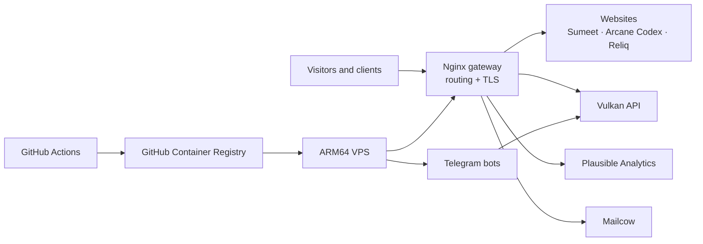

# Aether

A self-hosted Docker platform for running websites, APIs, bots, analytics, and email behind one production gateway.

Aether is the infrastructure layer for my personal and studio projects. It keeps local development and production deployment in one Compose-based system, builds service images with GitHub Actions, and rolls updates onto an ARM64 VPS without taking the entire stack down.

## What it manages

- Multiple websites and static applications
- A shared API and automation services
- Nginx routing and TLS termination
- Privacy-friendly analytics with Plausible
- Mail hosting through Mailcow
- Automated container builds and rolling deployments
- Certificate renewal, backups, and operational scripts

## Architecture



The base Compose file defines the shared service topology. Environment-specific overlays add local bind mounts, production images, analytics, and mail services as needed.

## Services

| Service | Role | Public project |
| --- | --- | --- |
| `gateway` | Nginx reverse proxy, routing, security headers, and TLS termination | — |
| `sumeetsaini_com` | Interactive personal website | [kungfusaini/sumeetsaini_com](https://github.com/kungfusaini/sumeetsaini_com) |
| `vulkan` | Shared API for projects, contact forms, and personal tools | [kungfusaini/vulkan](https://github.com/kungfusaini/vulkan) |
| `arcanecodex` | Hugo-powered writing and reference site | [kungfusaini/arcane-codex](https://github.com/kungfusaini/arcane-codex) |
| `reliqstudios` | Reliq Studios website | [kungfusaini/reliqstudios](https://github.com/kungfusaini/reliqstudios) |
| `reliqdigital` | Reliq digital-services website | [kungfusaini/reliq.digital](https://github.com/kungfusaini/reliq.digital) |
| `reliqlabs` | Reliq Labs website | [kungfusaini/reliqlabs](https://github.com/kungfusaini/reliqlabs) |
| `bucketbot` | Telegram automation and capture bot | [kungfusaini/bucketbot](https://github.com/kungfusaini/bucketbot) |
| `goblinbot` | Telegram interface for personal-finance data | [kungfusaini/goblinbot](https://github.com/kungfusaini/goblinbot) |
| `plausible` | Self-hosted, privacy-friendly analytics | [plausible/analytics](https://github.com/plausible/analytics) |
| `mailcow` | Self-hosted email stack | [mailcow/mailcow-dockerized](https://github.com/mailcow/mailcow-dockerized) |

Aether also hosts a small collection of private and standalone web applications that use the same gateway and deployment model.

## Compose model

| File | Purpose |
| --- | --- |
| `docker-compose.yml` | Shared service definitions and network topology |
| `docker-compose-dev.yml` | Local builds, bind mounts, ports, and development configuration |
| `docker-compose-prod.yml` | GHCR images, production volumes, and external networks |
| `docker-compose-plausible.yml` | Plausible and its data services |
| `docker-compose-mailcow.yml` | Mailcow integration |

Keeping these concerns in overlays makes the development stack lightweight while allowing production to opt into stateful infrastructure.

## Local development

### Requirements

- Docker with Compose v2
- Git with submodule support

Clone the repository and its service submodules:

```bash
git clone --recurse-submodules https://github.com/kungfusaini/aether.git
cd aether
```

Start the normal development stack:

```bash
docker compose \
  -f docker-compose.yml \
  -f docker-compose-dev.yml \
  up -d
```

Add local analytics when needed:

```bash
docker compose \
  -f docker-compose.yml \
  -f docker-compose-dev.yml \
  -f docker-compose-plausible.yml \
  up -d
```

Useful commands:

```bash
# Follow all service logs
docker compose logs -f

# Inspect running services
docker compose ps

# Stop the stack
docker compose down
```

### Local endpoints

| Surface | URL |
| --- | --- |
| Gateway | `http://localhost` |
| Personal website | `http://localhost:8080` |
| Vulkan API | `http://localhost:3000` |
| Arcane Codex | `http://localhost:1313` |
| Plausible | `http://stats.localhost` when its overlay is enabled |

Some gateway hostnames require matching entries in `/etc/hosts`; see the development Nginx configuration under `services/gateway/conf.d/dev/`.

## Deployment

The main GitHub Actions workflow:

1. Checks out the repository and service submodules.
2. Builds ARM64 images for the maintained services.
3. Pushes the resulting container images to GitHub Container Registry.
4. Copies Compose and operational files to the host.
5. Pulls changed images and updates services individually.
6. Removes unused images after a successful rollout.

Individual projects can also trigger focused deployments. For example, the `babbi.world` workflow updates only its own service rather than redeploying the full platform.

Production configuration is assembled from Compose overlays:

```bash
docker compose \
  -f docker-compose.yml \
  -f docker-compose-prod.yml \
  -f docker-compose-mailcow.yml \
  -f docker-compose-plausible.yml \
  up -d
```

This command documents the topology; a real deployment also requires host directories, external Docker networks, certificates, and secrets configured by the deployment environment.

## Operations

- [TLS certificate setup and renewal](docs/tls.md)
- [Mailcow domain onboarding](scripts/mailcow-add-domain.md)
- `scripts/setup-backup.sh` — configure backups
- `scripts/test-backup.sh` — exercise the backup path
- `scripts/verify-backup.sh` — verify backup output
- `scripts/cf-add-site.sh` — assist with Cloudflare site setup

## Repository layout

```text
.
├── .github/workflows/       # Build and deployment automation
├── docs/                    # Operational documentation
├── scripts/                 # TLS, backup, DNS, and mail helpers
├── services/                # Gateway plus application submodules
├── docker-compose.yml       # Shared topology
├── docker-compose-dev.yml   # Development overlay
├── docker-compose-prod.yml  # Production overlay
├── docker-compose-mailcow.yml
└── docker-compose-plausible.yml
```

## Security model

- Deployment credentials and application secrets are supplied through GitHub Actions secrets and host-managed environment values.
- The gateway centralizes TLS, proxy headers, and common security policy.
- Production-only credentials are not required for the normal development stack.
- Repository examples use placeholders; secrets should never be committed to Compose files.

## Scope

Aether is a working personal infrastructure repository rather than a turnkey hosting product. Its architecture and operational patterns are reusable, but production deployment assumes control of the target VPS, DNS, certificates, external networks, and service-specific secrets.
